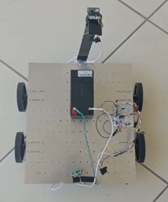
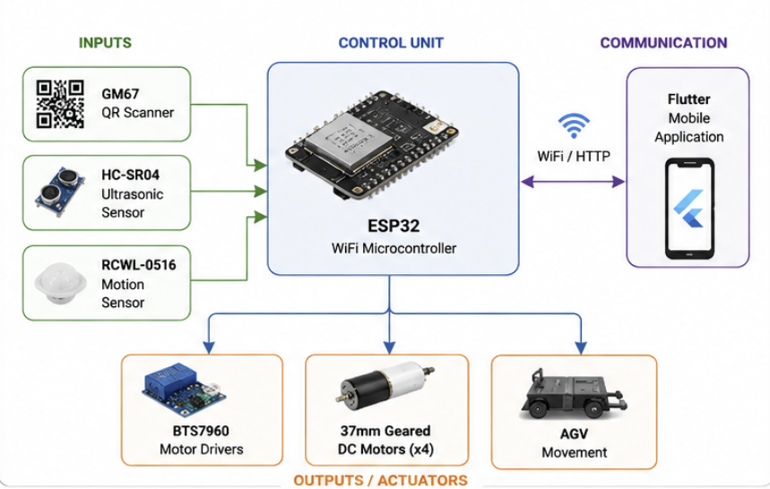
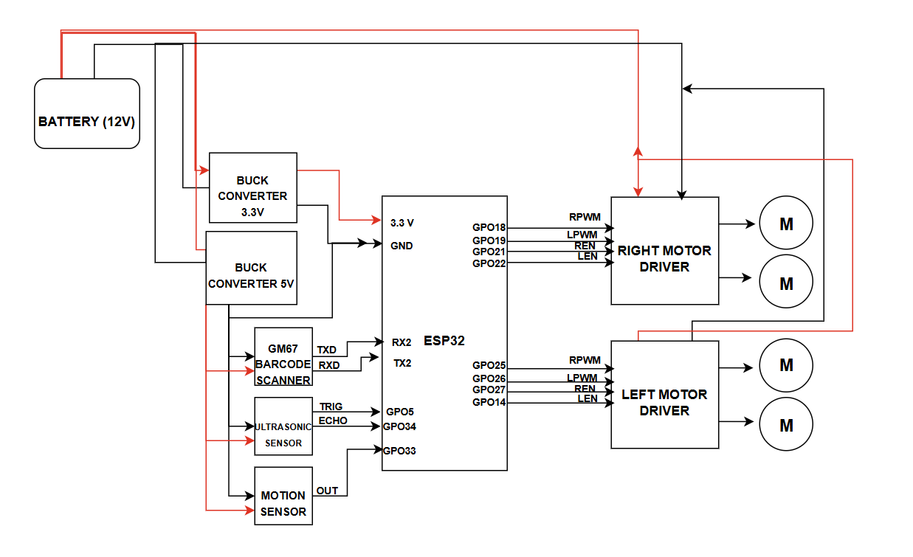
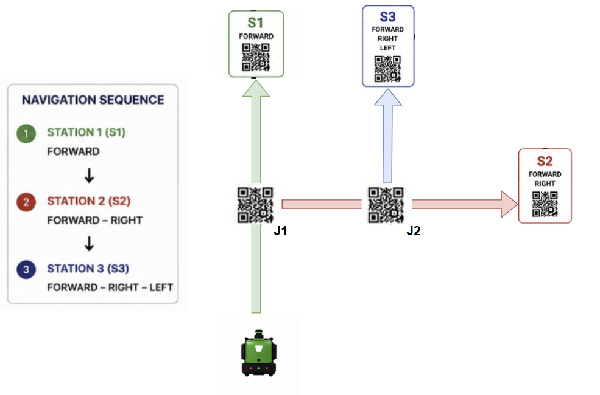
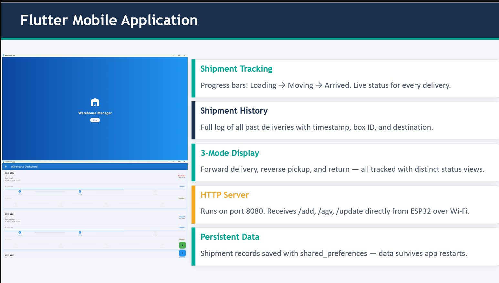

# QR-Based Autonomous Guided Vehicle (AGV) System

## Physical Prototype



Final AGV prototype developed for autonomous indoor transportation using QR-based navigation, wireless communication, and embedded control.

---

## System Architecture



The AGV system consists of navigation, sensing, communication, and motor control subsystems coordinated by an ESP32-WROOM-32D controller.

---

## Wiring Diagram



Electrical connections between the ESP32 controller, QR scanner, sensors, motor drivers, and power system.

---

## Navigation Layout



QR markers positioned at intersections provide routing instructions that guide the AGV toward its destination.

---

## Mobile Application



Flutter-based monitoring application used for cargo registration, AGV status tracking, and delivery monitoring.

---

# Project Overview

This project presents a QR-Based Autonomous Guided Vehicle (AGV) designed for autonomous indoor transportation and logistics operations.

The system utilizes QR markers placed at predefined decision points to perform navigation and routing. Unlike traditional line-following systems, the AGV can dynamically select routes based on QR instructions without requiring expensive localization technologies such as LiDAR.

The vehicle integrates autonomous navigation, obstacle detection, wireless communication, and mobile monitoring capabilities to provide a low-cost and scalable logistics solution.

---

# Key Features

* QR-Based Navigation
* Autonomous Indoor Transportation
* Multi-Destination Routing
* ESP32-Based Embedded Control
* QR/Barcode Reader Integration
* Obstacle Detection and Safety Control
* Wireless Monitoring
* Flutter Mobile Application
* Forward Delivery Mode
* Return-to-Origin Mode
* Reverse Pickup Mode
* State Machine Navigation Logic

---

# Hardware Components

| Component                 | Function           |
| ------------------------- | ------------------ |
| ESP32-WROOM-32D           | Main Controller    |
| GM67 QR Scanner           | QR Code Reading    |
| HC-SR04 Ultrasonic Sensor | Obstacle Detection |
| PIR Motion Sensor         | Cargo Detection    |
| BTS7960 Motor Drivers     | Motor Control      |
| 12V DC Geared Motors      | Vehicle Movement   |
| 12V Battery               | Power Supply       |

---

# Software Technologies

* Embedded C/C++
* Arduino IDE
* ESP32 Framework
* QR Data Processing
* State Machine Control Logic
* UART Communication
* Wi-Fi Communication
* Flutter Mobile Application

---

# Operating Modes

## Forward Mode

The AGV reads the destination QR code, confirms cargo placement using the PIR sensor, and autonomously navigates to the selected destination through QR-based routing instructions.

## Return Mode

The AGV performs a 180-degree turn and follows reverse routing instructions embedded within QR markers to return to its origin station.

## Reverse Pickup Mode

The AGV travels to a selected station, waits for cargo placement, and then autonomously returns to the origin station.

---

# Navigation Method

The navigation system is based on QR markers located at warehouse intersections and decision points.

Each QR marker stores routing instructions for multiple destinations.

Example:

```text
POINT=J1
ST01=FORWARD
ST02=RIGHT
ST03=RIGHT
```

The AGV scans the QR marker and determines the required movement based on the selected destination.

---

# Real-World Applications

Although the prototype was validated in a warehouse environment, the QR-based navigation architecture can be deployed in a wide variety of indoor logistics applications.

## Warehouses & Distribution Centers

* Inventory transportation
* Order fulfillment operations
* Material handling
* Storage management support

## Manufacturing Facilities

* Spare parts transportation
* Production line support
* Workstation material delivery
* Internal logistics operations

## Healthcare Facilities

* Medicine transportation
* Medical supply delivery
* Internal hospital logistics
* Equipment transportation

## Airport Logistics

* Equipment transportation
* Baggage support operations
* Internal service logistics
* Cargo movement between stations

## Hotels & Hospitality

* Room service delivery
* Laundry transportation
* Internal logistics operations
* Customer service assistance

## Universities & Research Laboratories

* Equipment transportation
* Laboratory material delivery
* Campus logistics operations
* Research facility support

## Restaurant & Food Services

* Food delivery between stations
* Kitchen-to-service transportation
* Tray transportation
* Internal logistics support

---

# Safety Features

* Real-Time Obstacle Detection
* Automatic Emergency Stop
* QR Duplicate Filtering
* Controlled Turning Operations
* Sensor-Based Navigation Verification

---

# Project Results

The AGV successfully demonstrated:

* Reliable QR-based navigation
* Autonomous multi-station routing
* Obstacle avoidance functionality
* Wireless monitoring capabilities
* Return and reverse operating modes
* Autonomous indoor transportation

---

# Future Improvements

* ROS2 Integration
* Computer Vision Assistance
* Autonomous Charging Station
* Fleet Management Support
* Cloud-Based Monitoring
* Enhanced Localization Techniques

---

# Author

**Sarah Aidaros**

Mechatronics Engineer

Robotics | Embedded Systems | Autonomous Systems

GitHub:
https://github.com/Sarah-idaros

LinkedIn:
https://linkedin.com/in/saraaidaros
